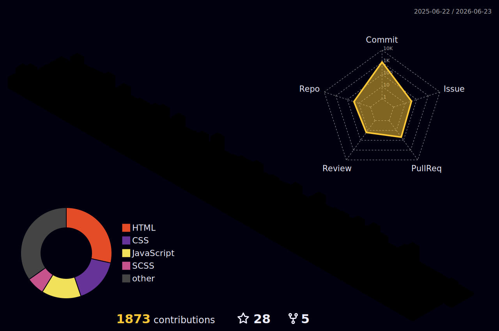

<a href="https://www.linkedin.com/in/AleksandrFrolov2809">
</a>

# Hey there! I'm Alex

### 💻 Frontend Developer | UI & UX Enthusiast

Frontend Developer specializing in building modern web applications with React. Experienced in collaborating
within agile teams alongside designers and product managers. Contributed to the development of new
features, bug fixing, application maintenance, and performance optimization. Passionate about writing clean,
maintainable code, improving user experience, and continuously expanding technical expertise.

Confident in building responsive and scalable user interfaces, applying component-based architecture, and
integrating frontend solutions with backend APIs. Experienced in using modern development tools and workflows,
including Git, task management systems, and code review processes. Able to quickly understand existing
codebases, identify areas for improvement, and implement effective solutions.

In an era where AI writes code, it's important to think not only about how software works, but also about how people interact with it. I focus on creating intuitive user experiences while keeping business metrics and product goals in mind.

---

## 📮 Contact & Social

<p align="center">
   <a href="https://instagram.com/alexfrxx"></a>
  <a href="https://www.linkedin.com/in/AleksandrFrolov2809/"></a>
<a href="mailto:fr.280907@gmail.com"></a>
<a href="https://x.com/AleksandrFr2007"></a>
<a href="https://t.me/alexFrxx"></a>
  <a href="https://alexfrxx.vercel.app"></a>
</p>
<p align="center"><em>Let’s build something meaningful together.</em></p>

## 💻 Technology Stack

### Languages


### UI Libraries & Styling


### Build Tools & Package Managers


### Version Control & CI/CD


### Cloud & DevOps


### AI & Neural Networks


### CMS & Web Builders


### Development Tools & IDEs


---

<div align="center">
  

</div>

## 📈 Github Stats & Activity Graph

<div align="center">
 
  
</div>

<div align="center">
   

</div>

## ⏳ Time Invested in Coding

<!--START_SECTION:waka-->

```txt
Total Time: 166 hrs 10 mins

JavaScript    43 hrs 14 mins        ██████▓░░░░░░░░░░░░░░░░░░   26.00 %
HTML          37 hrs 2 mins         █████▓░░░░░░░░░░░░░░░░░░░   22.28 %
SCSS          35 hrs 50 mins        █████▒░░░░░░░░░░░░░░░░░░░   21.55 %
CSS           32 hrs 44 mins        █████░░░░░░░░░░░░░░░░░░░░   19.69 %
TypeScript    7 hrs 43 mins         █░░░░░░░░░░░░░░░░░░░░░░░░   04.65 %
JSON          3 hrs 25 mins         ▓░░░░░░░░░░░░░░░░░░░░░░░░   02.06 %
Less          2 hrs 10 mins         ▒░░░░░░░░░░░░░░░░░░░░░░░░   01.31 %
Image (svg)   2 hrs 4 mins          ▒░░░░░░░░░░░░░░░░░░░░░░░░   01.25 %
Markdown      1 hr 13 mins          ▒░░░░░░░░░░░░░░░░░░░░░░░░   00.74 %
INI           12 mins               ░░░░░░░░░░░░░░░░░░░░░░░░░   00.12 %
```

<!--END_SECTION:waka-->

<p align="center"><em>Thank you for visiting my profile — the projects are listed below🔻</em></p>
